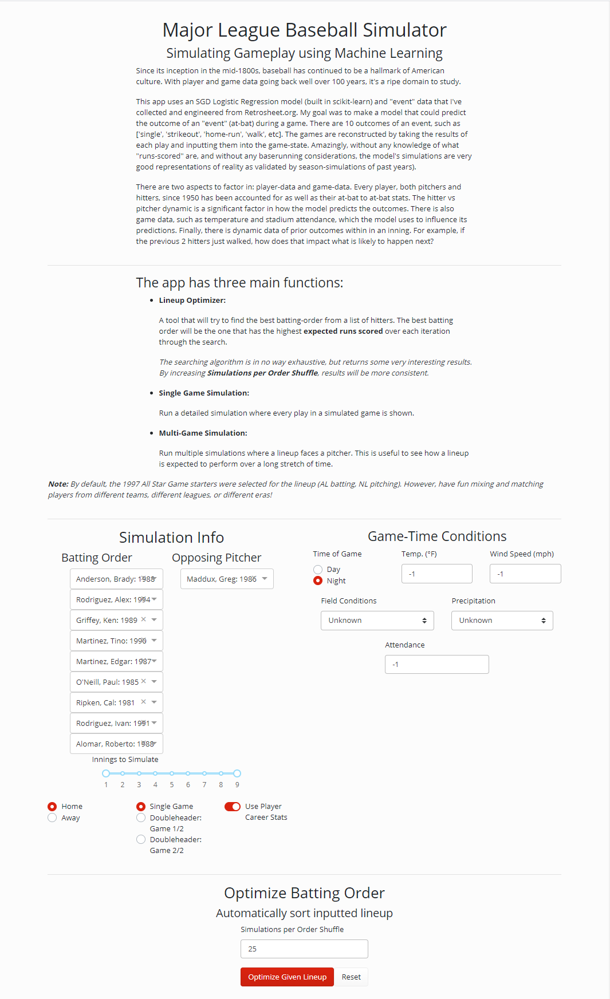

# Heroku Web App

### Launch the deployed app <a href='https://capstone-baseball-simulator.herokuapp.com/'>HERE!</a>
> https://capstone-baseball-simulator.herokuapp.com/

## Built in Python with Dash

### For the project repo, visit: <a href='https://github.com/cwf231/dsc_capstone'>github.com/cwf231/dsc_capstone</a>

# Summary

- This app functions as a Lineup Optimizer and Game Simulator.

- The Simulator uses:
  - a `SGD LogReg` model (built in scikit-learn).
  - two `Pipelines` for preprocessing (also built in scikit-learn)
  - a `PlayerFinder` (built using data from retrosheet.org).
  - a `League` object (containing `Hitters` and `Pitchers`) to access player stats.
  
- The Simulator works by:
  - Predicting the outcome of an at-bat with probabilities given to (Single, Double, Triple, Homerun, Walk, Strikeout, Out, Error, Sacrifice, Interference).
    - The outcome of the given at-bat is chosen with the associated weights.
  - Using *wiffle-ball rules* (okay, I made this term up), batters advance and the game-state is updated.
    - *Wiffle-ball rules*: base runners cannot steal and only move up a fixed number of bases when a hit occurs. For example, a runner on second *would not score on a single* even though sometimes they would in a live game.
  - Given the current game-state and past outcomes, the next at-bat is processed.
  
- The Optimizer works by:
  - Testing each spot in the batting order compared to a control group.
  - *Total runs scored* is measured and the player with the highest will be chosen to be "locked-in".
> *For example: *
>
> *Given Lineup: `[h1,h2,h3,h4,h5,h6,h7,h8,h9]`*
> 
> *Attempt 1: `[h1,'','','','','','','','']`*
> 
> *Attempt 2: `[h2,'','','','','','','','']`*
> 
> *Attempt 3: `[h3,'','','','','','','','']`*
> 
> *. . .*
> 
> *`# once a player is evaluated as providing the highest 'expected-runs-scored', they are 'locked-in' for the rest of the iterations.`*
> 
> *Example: `h3` was chosen to be locked in for the first spot in the lineup.*
> 
> *Attempt 10: `[h3,'h1','','','','','','','']`*
>
> *Attempt 11: `[h3,'h2','','','','','','','']`*
>
> *Attempt 12: `[h3,'h4','','','','','','','']`*
> 
> . . .
> 
> *`# and so on...`*

- While it is in no way exhaustive, it does logically select an optimized lineup.
  - There are ~360,000 possible permutations for a 9-player lineup. Since each lineup is tried several times (default: 25), it's not reasonable to iterate over all permutations.
